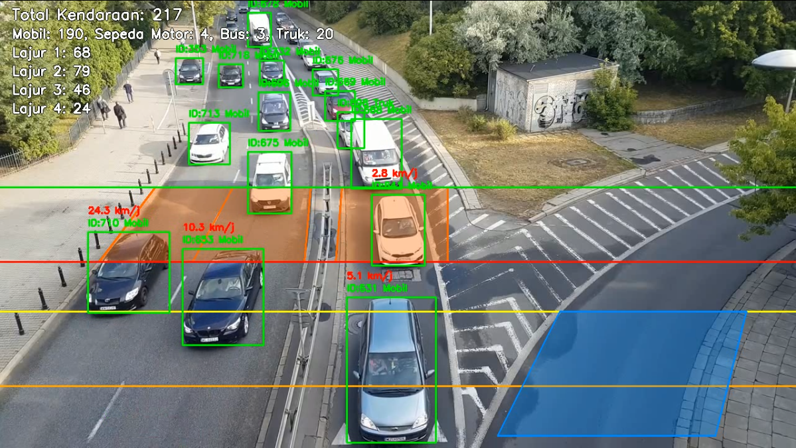

# Sistem Monitoring Lalu Lintas Berbasis YOLOv8 dan SORT

Proyek ini dibuat untuk pendaftaran magang sebagai MLops di **Human Plus Institute** oleh **Dimas Ibnu Muthi**.

---

## Output Sistem



🔗 [Klik di sini untuk melihat video output](https://youtu.be/BRKZh2Jqeo4)
---

## Pengenalan
Sistem ini bertujuan untuk mendeteksi, menghitung, dan menganalisis kendaraan pada video lalu lintas secara otomatis. Dengan memanfaatkan model YOLOv8 dan algoritma tracking SORT, sistem ini mampu melakukan klasifikasi jenis kendaraan, menghitung jumlah kendaraan yang melintas, estimasi kecepatan, serta rekap per lajur.

---

## Deskripsi Video
Video yang digunakan merupakan rekaman lalu lintas jalan raya dengan beberapa lajur (lane). Setiap kendaraan yang melintas akan dideteksi dan dianalisis secara real-time.

---

## Fitur Utama
- **Deteksi Jenis Kendaraan**
  - Mengklasifikasikan kendaraan ke dalam kategori: mobil, truk, bus, sepeda motor.
- **Deteksi Jumlah Kendaraan yang Melintas**
  - Menghitung total kendaraan yang terekam pada video.
- **Deteksi Kecepatan Kendaraan**
  - Mengestimasi kecepatan kendaraan berdasarkan waktu crossing dan jarak antar garis pada frame.
- **Deteksi Jumlah Kendaraan Berdasarkan Lajur**
  - Menghitung jumlah kendaraan per lajur (lane) secara akurat.

---

## Penjelasan File
| File                | Fungsi                                                                                                     |
|---------------------|------------------------------------------------------------------------------------------------------------|
| `config.py`         | Menyimpan semua konfigurasi utama: path video/model, kelas kendaraan, koordinat poligon lajur, garis start/end, dan jarak kalibrasi. |
| `analysis_utils.py` | Berisi fungsi-fungsi analisis seperti: cek lajur kendaraan, estimasi kecepatan, deteksi crossing lajur 4, dan voting lajur dominan. |
| `sort.py`           | Algoritma tracking SORT (diambil dari repo GitHub aslinya), digunakan untuk melacak ID kendaraan antar frame. |
| `visualizer.py`     | Fungsi visualisasi: menggambar poligon lajur, garis start/end, kotak kendaraan, ID, speed, serta statistik di frame video. |
| `vehicle_detector.py`| Kelas deteksi kendaraan dengan YOLOv8, termasuk filter confidence dan heuristik re-klasifikasi bus/truk kecil ke mobil. |
| `main.py`           | Script utama: proses video, deteksi, tracking, counting, speed estimation, visualisasi, dan ekspor hasil ke JSON. |

---

## Contoh Tabel Hasil Evaluasi

|                | Real | Model | Error   | Accuracy  |
|----------------|------|-------|---------|-----------|
| Total Kendaraan| 349  | 333   | 4.58%   | 95.42%    |
| Lajur 1        | 113  | 103   | 8.85%   | 91.15%    |
| Lajur 2        | 125  | 120   | 4.00%   | 96.00%    |
| Lajur 3        | 76   | 75    | 1.32%   | 98.68%    |
| Lajur 4        | 35   | 35    | 0.00%   | 100.00%   |
| Mobil          | 319  | 291   | 8.78%   | 91.22%    |
| Truk           | 21   | 33    | 57.14%  | 42.86%    |
| Bus            | 4    | 5     | 25.00%  | 75.00%    |
| Sepeda Motor   | 5    | 4     | 20.00%  | 80.00%    |

|                | Overall Accuracy |
|----------------|------------------|
| Total Kendaraan| 95.42%           |
| Per Lajur      | 96.46%           |
| Per Tipe       | 72.27%           |

---

## Instalasi & Library yang Dibutuhkan

### Spesifikasi
- Python 3.11
- Pytorch (disarankan versi CUDA untuk GPU, sesuai versi GPU dan driver)

### Library Python
- ultralytics (YOLOv8)
- opencv-python
- numpy
- torch

### Cara Instalasi
1. Clone repo atau copy semua file ke satu folder.
2. Install semua dependensi:
   ```bash
   pip install ultralytics opencv-python numpy torch
   ```
3. Pastikan file video dan model YOLOv8 (`yolov8x.pt`) sudah ada di folder yang sesuai.
4. Jalankan script utama:
   ```bash
   python main.py
   ```
5. Hasil analisis akan tersimpan di `hasil_analisis.json` dan video output di `traffic_output.mp4`.

---

## Catatan Tambahan
- Untuk hasil speed yang akurat, sesuaikan nilai `DISTANCE_METERS` di `config.py` dengan jarak sebenarnya di lapangan.
- Tracking kendaraan menggunakan SORT agar ID konsisten antar frame.
- Model deteksi yang digunakan adalah **YOLOv8x** (`yolov8x.pt`), yaitu model YOLOv8 versi terbesar dan paling akurat, namun juga paling berat dan membutuhkan GPU yang cukup kuat.
- Jika proses deteksi terlalu lambat, Anda bisa ganti modelnya di `config.py`:
  - Gunakan model yang lebih ringan seperti `yolov8m.pt`, `yolov8s.pt`, atau `yolov8n.pt`
  - Ganti variabel `MODEL_PATH` di `config.py` dengan nama file model yang diinginkan.
  - Contoh: `MODEL_PATH = 'yolov8s.pt'`

---

Bismillah lolos Aamiin.
